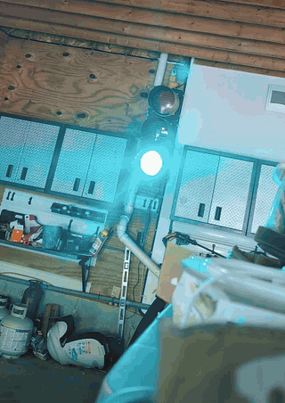
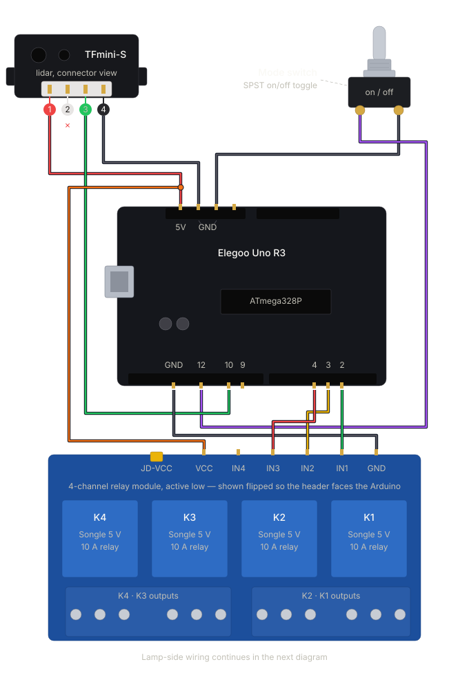

# Smart Traffic Light Parking Assistant

An Arduino-based garage parking assistant that uses a TFmini-S LiDAR sensor to drive a 3-color traffic light, helping you park your car in exactly the right spot. A toggle switch lets the same hardware double as a decorative summer-mode traffic light cycle.

## Demo



Parking mode at real speed: green to pull in, yellow to slow down, solid red at the spot. The car rolls in a few inches too far, gets flashing red, and backs off.

## Features

- **Distance-based parking guidance** using a TFmini-S LiDAR sensor over UART
- **Four guidance states** with hysteresis to prevent flicker on threshold boundaries:
  - `GREEN` — pull in (≤ 22.5 ft)
  - `YELLOW` — slow down (≤ 10 ft)
  - `SOLID RED` — stop, perfect park (≤ 4 ft)
  - `FLASHING RED` — too close, back off (≤ 3 ft)
- **Wake-up detection**: if a car is already parked at boot, the lights stay off so you can back out without distraction. The system re-arms automatically once the car clears.
- **Auto power-down**: lights turn off after the car has been parked for a while.
- **Summer mode**: a physical switch flips the unit into a classic Green → Yellow → Red traffic light cycle, with an automatic shutoff after ~300 cycles (~2 hours) to spare the relays. Flip back to parking mode to reset the counter.
- **Boot light show**: each light cycles on in sequence, then all three fire simultaneously as a hardware self-test. On AVR boards (Uno/Nano) the synchronized flash uses direct `PORTD` manipulation so the relays click as one; other boards fall back to `digitalWrite`.
- **Active-low relay support** with a friendly `RELAY_ON` / `RELAY_OFF` abstraction.
- **Checksummed LiDAR frames** to reject corrupt readings.

## Hardware

- Arduino Uno R3 (ATmega328P) — also works on Nano or any pin-compatible 5V AVR board
- Benewake TFmini-S LiDAR sensor (UART mode, 115200 baud, 4-pin connector, 0.1–12 m range)
- 4-channel 5V active-low relay module (only 3 channels used — green / yellow / red)
- SPST ON-OFF toggle switch for mode selection

### Wiring diagrams

The build is split into two wiring diagrams — the low-voltage control side and the AC load side.

**Control side** (Arduino ↔ TFmini-S ↔ relay inputs ↔ mode switch):



**Relay → lamp side** (each relay channel switching its bulb on AC mains):



> ⚠ The relay-to-lamp diagram involves AC mains. Wire only with the circuit de-energized and follow your local electrical code.

### Pin map

| Function                            | Arduino Pin         |
| ----------------------------------- | ------------------- |
| Green light relay                   | D2                  |
| Yellow light relay                  | D3                  |
| Red light relay                     | D4                  |
| Mode switch                         | D12 (input pull-up) |
| SoftwareSerial RX (← LiDAR TXD)     | D10                 |
| SoftwareSerial TX (→ LiDAR RXD)     | D9 (leave unplugged)|

### Sensor connector

The TFmini-S ships with a 4-pin cable:

| TFmini-S pin | Wire color | Connects to             |
| ------------ | ---------- | ----------------------- |
| 1 — +5V      | Red        | Arduino 5V              |
| 2 — RXD      | White      | *leave unconnected*     |
| 3 — TXD      | Green      | Arduino D10             |
| 4 — GND      | Black      | Arduino GND             |

> **Note:** Pin 9 (TX to the LiDAR) should be left unplugged, and the sensor's white RXD wire left unconnected. The TFmini-S runs on 5V but its UART is 3.3V logic, so the Arduino's 5V TX line can damage it. The sensor streams data continuously, so no commands need to be sent.

### Mode switch

- Switch closed (D12 → GND): **Parking mode** (LiDAR-driven)
- Switch open: **Summer mode** (timed traffic light cycle)

## Calibration

Distances are tuned for a garage with a 21" deep wall shelf at the back. Adjust these constants near the top of [traffic_light.ino](traffic_light.ino) to match your space:

```cpp
const int idleDistance   = 270;  // GREEN turns on at this range or closer
const int slowDistance   = 120;  // switch to YELLOW
const int stopDistance   = 48;   // SOLID RED — perfect park
const int dangerDistance = 36;   // FLASHING RED — too close
```

All values are in inches.

## Build & Upload

1. Install the Arduino IDE.
2. Open [traffic_light.ino](traffic_light.ino).
3. Select your board and serial port.
4. Upload.

`SoftwareSerial` is included with the Arduino IDE; no extra libraries are required.

## Serial output

Open the Serial Monitor at **9600 baud** to see live distance readings and state transitions, useful for tuning the threshold constants.
